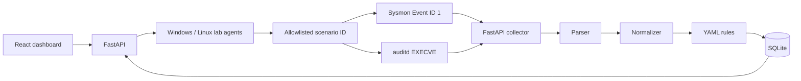
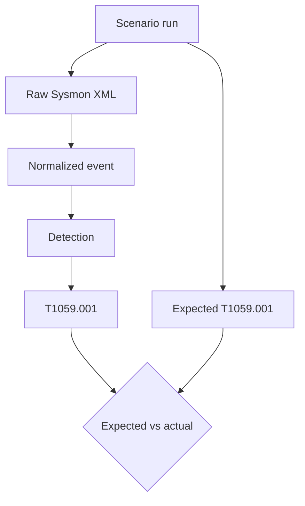

# Architecture

```mermaid
flowchart LR
  UI[React dashboard] --> API[FastAPI]
  API --> Agent[Windows / Linux lab agents]
  Agent --> Activity[Allowlisted scenario ID]
  Activity --> Sysmon[Sysmon Event ID 1]
  Activity --> Audit[auditd EXECVE]
  Sysmon --> Collector[FastAPI collector]
  Audit --> Collector
  Collector --> Parser --> Normalizer --> Rules[YAML rules] --> DB[(SQLite)]
  DB --> API
```

```mermaid
flowchart TD
  Run[Scenario run] --> Raw[Raw Sysmon XML]
  Raw --> Event[Normalized event]
  Event --> Detection[Detection]
  Detection --> Attack[T1059.001]
  Run --> Expected[Expected T1059.001]
  Attack --> Compare{Expected vs actual}
  Expected --> Compare
```

The backend records a detection gap naturally: a run can be `simulation_status=success` while telemetry or detection remains pending. No status is inferred by a timer.
